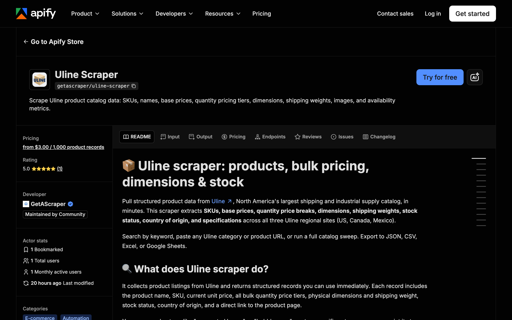

<div align="center">

# Uline Scraper: Products, Bulk Pricing and Stock

[](https://apify.com/getascraper/uline-scraper)
[](https://apify.com/getascraper/uline-scraper)
[](https://apify.com/getascraper/uline-scraper)
[](https://github.com/getascraper/how-to-scrape-uline/issues)
[](https://github.com/getascraper/how-to-scrape-uline/commits/main)

Scrape Uline product catalog data: SKUs, names, base prices, quantity pricing tiers, dimensions, shipping weights, images, and availability metrics.

[](https://apify.com/getascraper/uline-scraper)

</div>

---

## Why use Uline Scraper

* **Procurement and cost benchmarking**: Compare Uline's bulk pricing tiers against your current supplier costs and identify the quantity break that optimizes your per unit spend.
* **Freight and logistics automation**: Pull exact length, width, height, and shipping weight for every SKU to feed shipping cost calculators and carrier rate engines.
* **Reseller margin protection**: Monitor prices on boxes, poly bags, and packing materials so your resale margins stay accurate as input costs shift.
* **Catalog and assortment mapping**: Build a complete snapshot of Uline's packaging, storage, or janitorial lines to inform product strategy.
* **Inventory and reorder planning**: Track stock status across SKUs to anticipate supply gaps and coordinate replenishment before a shortage hits.

---

## How to use Uline Scraper

1. Choose a scraping mode: search by keyword, paste specific Uline URLs, or run a full catalog sweep.
2. Enter your search keywords or start URLs, and pick a Uline region (US, Canada, or Mexico).
3. Click **Start**: The actor collects every matching product and writes one flat row per item.
4. **Download your results**: Export as Excel, CSV, JSON, or HTML from the Output tab.

---

## Input

| Field | Type | Required | Description |
| --- | --- | :---: | --- |
| `scrapeMode` | string | No | How to find products: search by keyword, provided URLs, or full catalog auto discovery. Defaults to search by keyword. |
| `startUrls` | array | No | Uline category, listing, or product detail URLs to scrape. |
| `searchQuery` | string | No | Search term to look up across Uline. Required in search by keyword mode. |
| `domain` | string | No | Regional Uline site: uline.com (US), uline.ca (Canada), or uline.mx (Mexico). |
| `language` | string | No | Language subpath: English, French, or Spanish. |
| `includeSpecs` | boolean | No | Extract product length, width, height, and shipping weight. |
| `includeTiers` | boolean | No | Extract all quantity price breaks for bulk discount analysis. |
| `includeDescription` | boolean | No | Extract the product description text from each detail page. |
| `includeGallery` | boolean | No | Extract all secondary product image URLs. |
| `maxItems` | integer | No | Maximum number of products to collect in one run. Defaults to 120. |

---

## Output

Each row in your dataset is one Uline product. All fields are flat with no nested objects beyond simple arrays, so the file opens cleanly in any spreadsheet program.

```json
{
  "sku": "S-4314",
  "name": "Lightweight 32 ECT Box",
  "description": "Lightweight corrugated box for cost-effective shipping.",
  "category": "Boxes",
  "subcategory": "Corrugated Boxes",
  "unit_price": 0.52,
  "currency": "USD",
  "price_tiers": [
    { "quantity": 1, "price": 0.52 },
    { "quantity": 25, "price": 0.44 },
    { "quantity": 100, "price": 0.38 }
  ],
  "dimensions": "6 x 6 x 6\"",
  "length": 6,
  "width": 6,
  "height": 6,
  "weight_lbs": 0.2,
  "availability": "In Stock",
  "in_stock": true,
  "country_of_origin": "USA",
  "image_url": "https://images.uline.com/is/image/uline/S-4314",
  "product_url": "https://www.uline.com/Product/Detail/S-4314/Boxes/Lightweight-32-ECT-Box",
  "scraped_at": "2026-06-27T12:00:00.000Z"
}
```

### Data table

| Field | Type | Description |
| --- | :---: | --- |
| `sku` | string | Unique Uline SKU or model number. |
| `name` | string | Full product name as shown on the Uline listing. |
| `description` | string | Product description text, when available. |
| `category` | string | Top-level category from the breadcrumb trail. |
| `subcategory` | string | Nested subcategory from the breadcrumb trail. |
| `unit_price` | number | Base single-unit price in the regional currency. |
| `currency` | string | Currency code: USD, CAD, or MXN. |
| `price_tiers` | array | All quantity price breaks, each with a quantity and price. |
| `dimensions` | string | Combined dimension string, for example 6 x 6 x 6 inches. |
| `weight_lbs` | number | Shipping weight in pounds. |
| `availability` | string | Raw stock status text from the product page. |
| `in_stock` | boolean | Whether the product is currently in stock. |
| `country_of_origin` | string | Country where the product is manufactured, when listed. |
| `image_url` | string | Main product image link. |
| `product_url` | string | Direct link to the product page on Uline. |
| `scraped_at` | string | Extraction time in ISO 8601 format. |

---

## Pricing

**$4.00 per 1,000 results.** No monthly subscriptions and no minimum commits. New Apify accounts include $5 of free usage, so you can try it before you pay.

You only pay for the product records you collect. A typical run of 100 products completes in a few minutes.

---

## Quick start

Create a `.env` file from `.env.example`, add your [Apify API token](https://console.apify.com/account/integrations), and run:

```bash
npm install
npm start
```

The script uses the [Apify API client](https://docs.apify.com/api/client/js/) to start the [Uline Scraper](https://apify.com/getascraper/uline-scraper) actor and fetch results.

---

## Tips and optimization

* **Search mode for quick sweeps**: Enter a keyword like "poly bags" or "packing tape" to pull matching SKUs across the catalog without knowing the category structure.
* **Provided URLs for targeted runs**: Paste a specific category page to focus the scraper on exactly one product line and get results faster.
* **Turn off enrichment to go faster**: If you only need SKUs and base prices, toggle off descriptions, gallery images, and specs.
* **Scrape all three regions in parallel**: Start one run per domain to compare North American pricing side by side.

---

## FAQ

**Is it legal to scrape Uline?**
Scraping publicly available product catalog data is generally legal in most jurisdictions. This actor collects only public product information and no private account data. You are responsible for how you use the data and for following Uline's terms and applicable laws.

**Do I need a Uline account or login?**
No. The actor reads public product and category pages, so no Uline account or password is needed.

**Why is price tier data missing for some products?**
Some Uline products are sold only in standard single-unit quantities with no bulk discount structure. The actor captures price tiers only when Uline displays them, and omits the field otherwise so your dataset stays clean.

**Can I run a full catalog sweep?**
Yes. Set the scraping mode to full catalog and the actor will follow category and subcategory links automatically. Set a maximum products limit to cap the run size and cost, since Uline's catalog contains tens of thousands of SKUs.

---

## Support

For bug reports, missing fields, or feature requests, open an issue under the [Issues](https://github.com/getascraper/how-to-scrape-uline/issues) tab, or visit the [Uline Scraper](https://apify.com/getascraper/uline-scraper) actor page on Apify.
